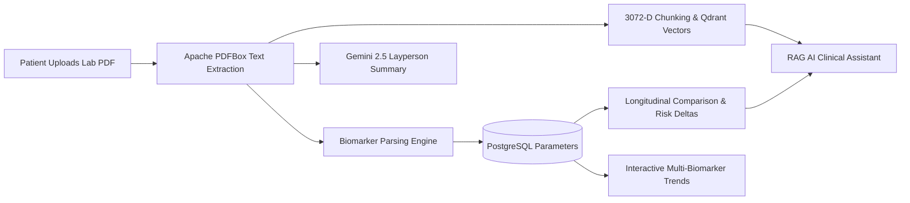

# Patient Health Intelligence Platform 🏥🤖

An intelligent, full-stack medical AI assistant that ingests patient clinical reports (PDFs), performs semantic retrieval-augmented generation (RAG) using **Google Gemini 2.5 Flash** and **Qdrant Vector Database**, automatically calculates longitudinal biomarker shifts over time, and provides plain-English layman explanations.

[](https://trycura.vercel.app/)
[](https://spring.io/)
[](https://react.dev/)
[](https://ai.google.dev/)

---

## 🌟 Key Capabilities & End-to-End Workflow



### 1. 📑 Automated Lab Report Ingestion
- Upload clinical PDF lab reports with drag-and-drop or select files from your device.
- Automatic text extraction via Apache PDFBox and tokenized biomarker isolation (Blood Pressure, Fasting Glucose, HbA1c, Hemoglobin, Lipid Panel, Creatinine).

### 2. 🤖 Plain-English Layperson AI Summaries
- Powered by **Google Gemini 2.5 Flash**.
- Translates cryptic medical ranges and clinical jargon into encouraging, actionable, plain-English summaries.
- One-click copy, print, and download capabilities.

### 3. ⚖️ Longitudinal Biomarker Shift & Risk Analysis
- Automatically compares consecutive lab tests to detect health shifts (e.g. `+16 mmHg Systolic BP` or `+20 mg/dL Fasting Glucose`).
- Color-coded alert badges (⚠️ Elevated, ✅ Improved, 🟢 Stable) with tailored doctor discussion suggestions.

### 4. 💬 RAG Medical Assistant Q&A
- Interactive conversational chat with pre-crafted clinical prompt chips.
- Semantic vector retrieval through **Qdrant (3072 dimensions)** with verifiable source citations and excerpt references.
- Structured markdown tables and list formatting.

### 5. 📈 Interactive Biomarker Trend Analytics
- Multi-biomarker time-series visualizations powered by Recharts.
- Combined **Dual Blood Pressure Tracker** (Systolic + Diastolic plotted simultaneously).
- Shaded green **Standard Normal Reference Range Zones** for immediate visual risk interpretation.

### 6. 📅 Unified Chronological Health Timeline
- Sequential record of all uploaded lab panels, consultations, and prescriptions with search and filter controls.

---

## 🛠️ Technology Stack

| Layer | Technologies |
| :--- | :--- |
| **Frontend** | React 19, Vite, TailwindCSS, Recharts, React Router 7, Axios |
| **Backend API** | Spring Boot 3.2, Java 17, Spring Security, Spring AI Google GenAI |
| **Vector DB** | Qdrant (3072-dimensional Cosine similarity search) |
| **Relational DB** | PostgreSQL 15 |
| **AI Foundation** | Google Gemini 2.5 Flash & Google GenAI Embeddings |
| **Deployment** | Vercel (Frontend), Docker Compose (Full Stack) |

---

## 🚀 Quickstart & Setup

### Prerequisites
- [Docker & Docker Desktop](https://www.docker.com/)
- [Google Gemini API Key](https://aistudio.google.com/)
- Java 17+ & Node.js 18+ (for local bare-metal development)

---

### Method 1: Docker Compose (Recommended)

1. Clone the repository:
   ```bash
   git clone https://github.com/suga528027-sketch/patient-health-intelligence.git
   cd patient-health-intelligence
   ```

2. Create a `.env` file from `.env.example`:
   ```env
   DB_USER=postgres
   DB_PASSWORD=postgres
   DB_NAME=healthplatform
   GEMINI_API_KEY=your_gemini_api_key_here
   JWT_SECRET=404E635266556A586E3272357538782F413F4428472B4B6250645367566B5970
   QDRANT_URL=http://qdrant:6333
   ```

3. Build and launch all containers:
   ```bash
   docker compose up --build -d
   ```

4. Open the frontend dashboard at **[http://localhost:5173](http://localhost:5173)**.

---

### Method 2: Bare-Metal Local Development

#### 1. Start Frontend
```bash
cd frontend
npm install
npm run dev
```

#### 2. Start Backend
```bash
cd backend
mvn spring-boot:run
```

---

## 🌐 Live Vercel Deployment & Interactive Demo Mode

The frontend is live at **[https://trycura.vercel.app/](https://trycura.vercel.app/)**.

- **Dual-Mode System**: When deployed without a local backend running, the application seamlessly activates an **Interactive Demo Mode** preloaded with realistic January & February 2026 clinical reports, allowing full test drives of all features (upload simulations, Gemini summaries, RAG chat, trends, and comparisons).
- **Connecting to a Cloud Backend**: Set the `VITE_API_URL` environment variable on Vercel to your deployed Spring Boot endpoint (e.g. `https://your-backend.railway.app/api` or `https://your-backend.onrender.com/api`).

---

## 🔒 Security & Privacy Notice

- All JWT tokens are signed using 256-bit cryptographic keys.
- Medical files are isolated per authenticated patient ID with strict authorization filters.
- *Disclaimer: This project is an educational proof-of-concept AI platform and should not be used as a substitute for professional clinical medical advice or diagnosis.*
